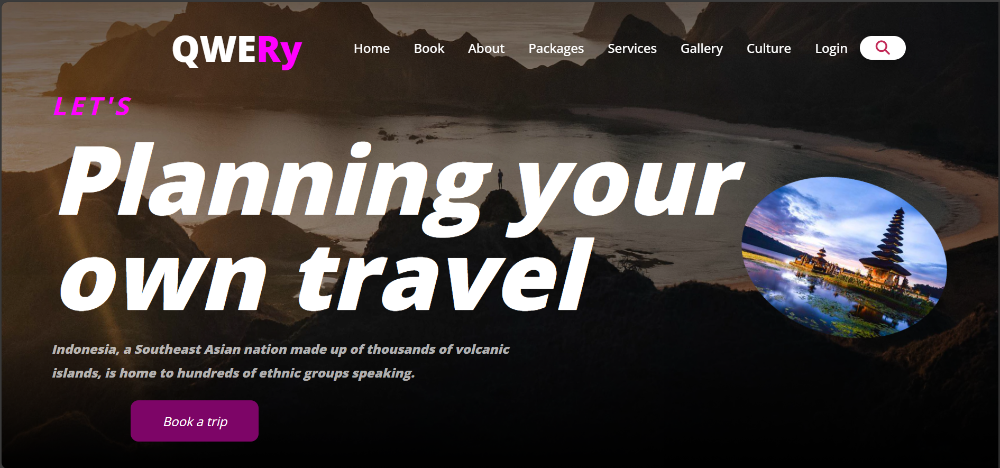

# 🌍 QWERY – Travel Website

A modern, responsive **travel website** designed to showcase destinations, travel packages, and services with rich animations and an engaging user interface.  
This project focuses on **UI/UX design**, smooth animations, and multi-page navigation using pure frontend technologies.

---

## ✨ Features

- 🏝️ Attractive landing page with hero section
- 🔍 Navigation bar with search functionality
- 📦 Travel packages with animated cards
- 🏖️ Destination highlights & gallery
- 🧾 Booking / login / signup UI
- 🎨 Advanced CSS animations & hover effects
- 📱 Fully responsive design for all devices

---

## 🛠️ Tech Stack

- **HTML5** – Page structure  
- **CSS3** – Styling, animations & responsiveness  
- **JavaScript** – Basic interactivity  
- **Google Fonts & Icons**

---

## 📸 Preview

---

## 🚀 Live Demo

🔗 View the live website here:  
**https://Anshu-dha.github.io/qwery-travel-website/**

---

## 🎯 Purpose of the Project

This project was created to:
- Practice **advanced CSS styling & animations**
- Build a **multi-page responsive website**
- Improve frontend UI/UX design skills
- Create a **portfolio-ready web project**

---

## 🔮 Future Improvements

- Backend integration for booking system
- Authentication with database
- Payment gateway integration
- Map & location services

---

## 👩‍💻 Author

**Anshu**  
Frontend Developer | Web Enthusiast  

---

⭐ If you like this project, don’t forget to star the repository!
